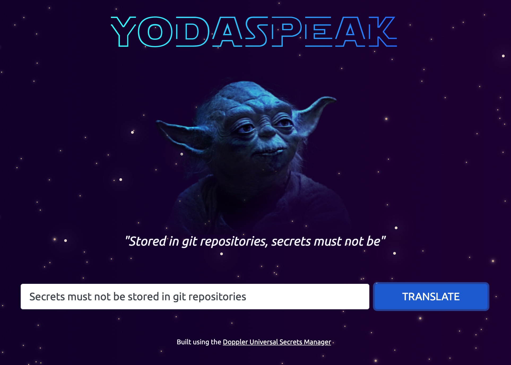

# Yoda Speak

[](https://yodaspeak.io/)

A simple application to translate English into Yoda's version, which is mostly, back to front, or, in other words, [object–subject–verb](https://en.wikipedia.org/wiki/Object%E2%80%93subject%E2%80%93verb) word order.

It's designed to show how to use the [Doppler Universal Secrets Manager](https://doppler.com/) for securely and easily fetching secrets and application configuration via environment variables.

## Requirements

- [Doppler CLI](https://docs.doppler.com/docs/enclave-installation)
- Node 14+

If on macOS, you can install these by running:

```sh
brew install dopplerhq/cli/doppler node
```

## Setting up

1. Install dependencies:

```sh
npm install
```

2. Use an `.env` file initially to supply secrets and configuration:

```sh
cp sample.env .env
```

3. Run the server:

```sh
npm start
```

## Running the app using Doppler

1. [Install Doppler](https://docs.doppler.com/docs/enclave-installation)
1. From a terminal, run:

```sh
doppler login
```

1. Once logged in, open a new browser window and [sign in to Doppler](https://dashboard.doppler.com/)
1. In the Doppler Web UI, create a workspace
1. Then [create a project](https://docs.doppler.com/docs/enclave-project-setup) called `yodaspeak`
1. Add the required secrets and configuration by uploading the contents of `sample.env` file, then save.
1. In a terminal, cd into the `yodaspeak` directory, then run:

```sh
# Configure Doppler to fetch the `yodaspeak` secrets from the `dev` config
doppler setup
```

To check that the Doppler CLI can access the project and retrieve its secrets, run:

```sh
doppler run -- printenv YODA
```

If secrets are displayed, Doppler is good to go! Now let's run the server.

> NOTE: The Yoda translation API used by the app is limited to 5 requests per hour unless you [register to purchase an API key](https://funtranslations.com/register). You can view the production site at [https://yodaspeak.io/](https://yodaspeak.io/)

Now let's use `doppler run` to call the `npm start` command, which will inject our secrets as environment variables that our app can use.

```sh
doppler run -- npm start
```

You can now access the site at [http://localhost:3000](http://localhost:3000)

## Using Docker

You can use Docker to run the app in the same way you would in production with a [Doppler service token](https://docs.doppler.com/docs/enclave-service-tokens), or you can configure it the same way you would a local development environment.

> NOTE: If you change the value for `PORT` in Doppler, then you'll need to update the port binding in the `docker container run` command to match. For example, if `PORT` were changed to `8080`, then it would be `-p 8080:8080`.

Using Docker requires a [Doppler service token](https://docs.doppler.com/docs/enclave-service-tokens) for a config populated with the secrets in the [sample.env file](sample.env), as all secrets will be fetched at runtime.

To run the Yoda Speak Docker container:

```sh
 docker container run -it --rm --init -e DOPPLER_TOKEN="dp.st.xxx" -p 3000:3000 dopplerhq/yodaspeak:latest
```

> NOTE: Check out the Docker specific commands in the `Makefile` for both Docker and Docker Compose.

## Using Repl.it

[](https://repl.it/github/dopplerhq/yodaspeak)

> NOTE: This is a work in progress and feedback is greatly appreciated!

You can quickly and easily run [YodaSpeak on repl.it](ttps://repl.it/github/dopplerhq/yodaspeak) by following the below steps once your environment has booted up:

1. If you haven't already, create a `yodaspeak` project in [Doppler](https://dashboard.doppler.com/), using the contents of the `sample.env` file to populate the initial set of secrets
2. Create a [Service Token](https://docs.doppler.com/docs/enclave-service-tokens) that will be used for fetching secrets in your repl.it environment
3. Now install and configure all required dependencies by running:

```sh
# You'll need to paste your Doppler Service Token when prompted
. ./bin/replit-setup.sh
```

Once setup, you can then start the server by clicking the **Run** button, or manually by running:

```sh
./bin/replit-start.sh
```

## Having trouble?

Create a GitHub issue, including your OS and Node version, and we'll help you out!
